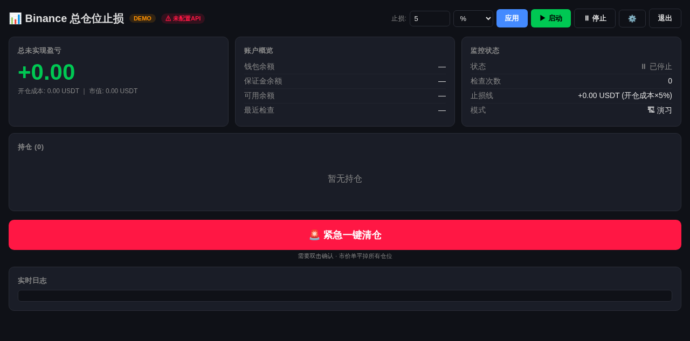
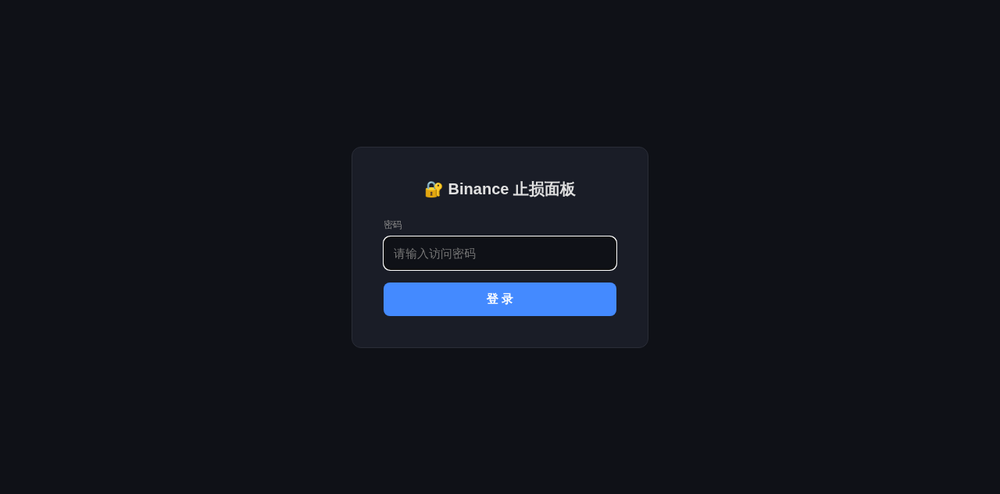
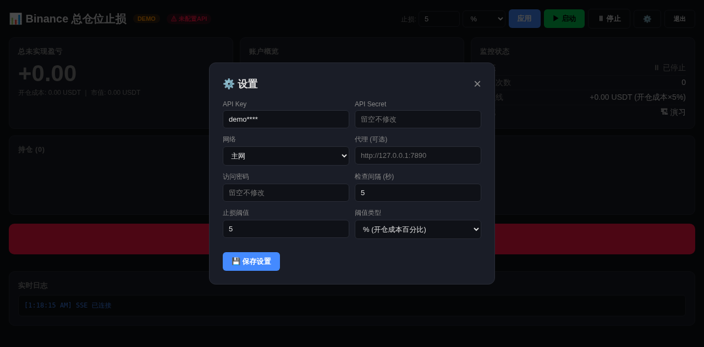

# Binance Portfolio Guard

币安合约全仓止损面板。支持**按仓位分组独立止损**，触及阈值一键清仓。



## 特性

- **仓位分组独立止损**：BTC 多+ETH 空 一组 5% 止损，山寨币 一组 3% 止损，互不影响
- **双模式**：USDT 绝对值 或 开仓成本百分比，止损线锚定入场价不漂移
- **多空正确**：多仓 SELL / 空仓 BUY，自动撤销挂单后市价平仓
- **零配置启动**：`./deploy.sh` 一键部署，首次访问 Web 引导设置密码
- **安全**：bcrypt + JWT + Setup Token + 限流 + 密码复杂度强制
- **5 秒轮询**：仅消耗 Binance API 5% 限额
- **API 限额**：每轮 10 weight × 12 轮/分 = 120 weight/分（限额 2400 的 5%）

## 快速开始

```bash
git clone https://github.com/kwingen/binance-portfolio-guard.git
cd binance-portfolio-guard
./deploy.sh
```

脚本自动检测 Docker 环境。首次启动控制台输出 Setup Token，浏览器打开 `http://localhost:8080` 完成初始化。



## 界面

| 仪表盘 | 设置面板 |
|--------|----------|
| 实时盈亏 / 持仓 / 分组卡片 / 紧急清仓 / 日志 | API Key / 代理 / 密码 / 仓位分组编辑器 |



## 止损模式

### 全局止损（未分组仓位）

| 模式 | 示例 | 计算 |
|------|------|------|
| USDT | -100 | 总盈亏 ≤ -100 止损 |
| % | 5 | 总盈亏 ≤ -(开仓成本 × 5%) 止损 |

### 仓位分组独立止损

```
📦 BTC+ETH 大仓位     5% 止损
   仓位: BTCUSDT多, ETHUSDT空

📦 山寨币组            3% 止损
   仓位: XRPUSDT多, XLMUSDT多, SOLUSDT空
```

触发时**只平该组仓位**，其他组不受影响。

## 安全

| 层级 | 措施 |
|------|------|
| 初始化 | 一次性 Setup Token，仅控制台可见 |
| 密码 | bcrypt 哈希，8 位 + 大小写 + 数字 + 特殊字符 |
| 会话 | JWT 60 分钟过期 |
| 防御 | Setup 端点 5 次/分钟限流，常数时间比较 |
| 运行时 | 非 root 用户，异常不泄露堆栈 |
| 操作 | 紧急清仓需双击确认 |

## 部署

```bash
# Docker
docker compose up -d

# 环境变量
export SL_PASSWORD="你的强密码"
export SL_BINANCE_API_KEY="..."
export SL_BINANCE_API_SECRET="..."

# 手动
pip install -r requirements.txt
cd client && npm ci && npm run build && cd ..
python -m uvicorn server.main:app --host 0.0.0.0 --port 8080
```

最低配置：1 vCPU / 256MB 内存，需固定公网 IP（Binance 白名单）。

## 技术栈

| 层 | 技术 |
|----|------|
| 后端 | FastAPI + Pydantic + uvicorn |
| 前端 | Vue 3 + Vite + Pinia + Vue Router |
| 实时 | SSE (Server-Sent Events) |
| 构建 | Docker 多阶段 + alpine |

## License

MIT
